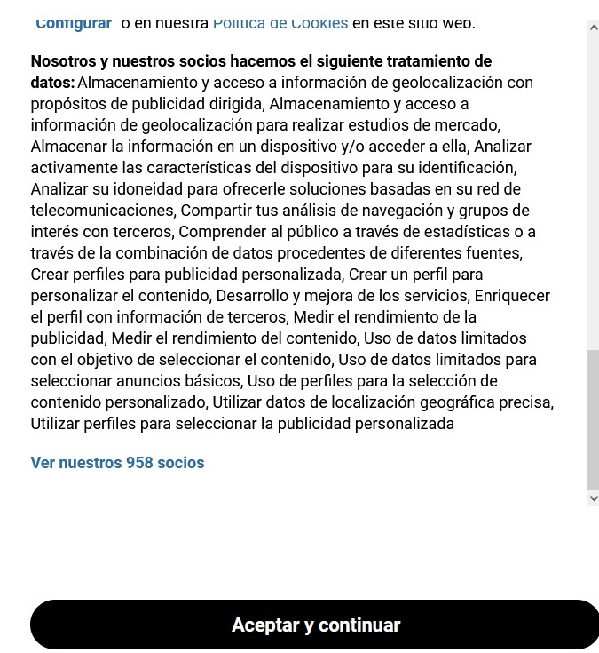

[English](#english)
[Español](#español)

---

# Hide Popup
This is an extension for chrome web browser that helps people when they see some web pages.

## Boring of this?

## Why is this extension useful?
Are you tired of seeing that before you could read some content in a website they ask you to accept their cookies (so all data they collect from you is sold to **a lot of companies**) or pay for the service and they don't collect your data? With this extension you can hide that popup and continue on that website.

## How to use it?
When you are in a website and you see the popup and it doesn't hide in a few seconds, then this version of the extension can't still hide the popup. You can click on the extension icon and press the **report** button. The next time the extension is updated it should work for that website.
Also you can deactivate or activate the extension for that website.

---

# Oculta Popup
Esta es una extensión para el navegador web Chrome que ayuda a las personas cuando ven algunas páginas web.

## ¿Cansado de esto?

## ¿Por qué es útil esta extensión?
¿Estás cansado de ver que antes de poder leer algún contenido en una web te piden que aceptes sus cookies (por lo que todos los datos que recogen de ti los venden a **muchas empresas**) o que pagues por el servicio y no recopilen tus datos? Con esta extensión puedes ocultar esa ventana emergente y continuar en esa web.

## ¿Cómo se usa?
Si estás en un sitio web y ves la ventana emergente y no se oculta en unos segundos, significa que la extensión no puede ocultar el popup con esta versión de extensión. Puedes hacer clic en el icono de la extensión y presionar el botón **reportar** si está activado y de color azul. Si está gris es que la extensión ya funciona para esa web. La próxima vez que se actualice la extensión, debería funcionar para ese sitio web.
También puedes desactivar o activar la extensión para ese sitio web.

